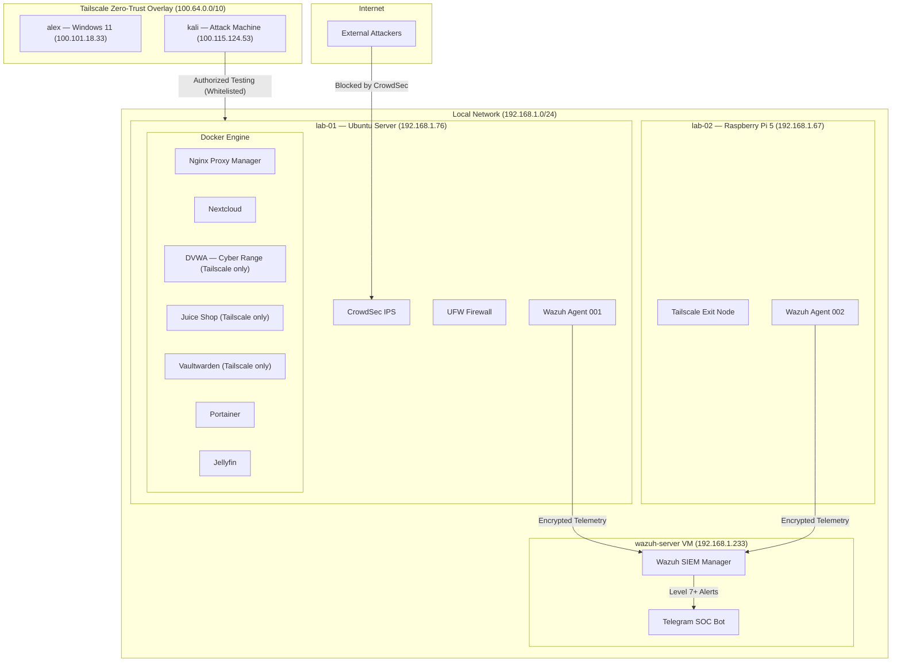

# My Homelab


## Overview

This repository documents my personal, isolated homelab environment built for practicing penetration testing, vulnerability assessment, and understanding web application security flaws. The infrastructure is designed to simulate a real-world, containerized corporate environment, complete with active defenses and zero-trust networking.

## Infrastructure & Network Architecture

The environment is hosted on an **Ubuntu Linux** server (`lab-01`) and a Raspberry Pi 5 (`lab-02`).

**Zero-Trust Overlay Network:** Access to the lab is strictly routed through **Tailscale** (WireGuard-based mesh network), making the internal services inaccessible from the public internet.

**Containerization:** All services run in highly isolated **Docker** containers (subnets `172.17.x.x`), protecting the host kernel.

> **Automation Script:** The entire process of disabling the commercial VPN, configuring the OpenVPN daemon, and re-establishing the Tailscale Exit Node heartbeat has been automated in bash. You can view the logic here: [`setup_vpn_routing.sh`](./scripts/setup_vpn_routing.sh)



| Host | Role | Local IP | Tailscale IP |
|------|------|----------|--------------|
| `lab-01` | Primary Ubuntu server — runs all Docker services | 192.168.1.76 | 100.81.69.74 |
| `lab-02` | Raspberry Pi 5 — ARM server, Tailscale Exit Node | 192.168.1.67 | 100.123.114.111 |
| `wazuh-server` | Proxmox VM — SIEM Manager & alerting | 192.168.1.233 | — |
| `kali` | Attack machine for authorized penetration testing | — | 100.115.124.53 |

## Security Perimeter (Defense in Depth)

To study both offensive and defensive mechanics, the lab is heavily monitored and secured.

**L4 Firewall:** **UFW** (Uncomplicated Firewall) enforces strict port-level access control.

**IPS (Intrusion Prevention System):** **CrowdSec** actively parses `auth.log`, `syslog`, and reverse proxy logs in real-time to ban malicious IPs. The community blocklist currently enforces bans on over 2,200 IPs. My Kali Linux attacker machine is explicitly whitelisted to allow continuous testing.

**SIEM:** **Wazuh** aggregates logs from all hosts via encrypted agents, correlates events against MITRE ATT&CK rules, and triggers real-time Telegram alerts for Level 7+ security events.

**DNS Sinkhole:** **AdGuard Home** manages DNS resolution, blocking trackers and malware domains at the network level.

## Active Service Inventory

The Docker engine on `lab-01` hosts multiple production and vulnerable services.

| Service | Purpose | Exposure |
|---------|----------|----------|
| **Nginx Proxy Manager** | Reverse proxying and SSL routing | Public (80/443) |
| **Nextcloud + MariaDB** | Self-hosted cloud storage — used to test brute-force protections | Public via NPM |
| **Jellyfin** | Media server | Public (8096) |
| **Portainer** | Docker management UI | Local + Tailscale |
| **Homarr** | Homelab dashboard | Local + Tailscale |
| **Vaultwarden** | Self-hosted password manager | Tailscale only |
| **DVWA** | Vulnerable web app — primary Cyber Range | Tailscale only |
| **Juice Shop** | Vulnerable web app — OWASP practice target | Tailscale only |

## Vulnerabilities Researched & Exploited

This ledger details the operations conducted against the lab's services.

### 1. Brute Force & Rate Limiting Evasion (Nextcloud)

**Operation:** Developed a custom Python script utilizing the `BeautifulSoup` library for web scraping.

**Execution:** Successfully performed dynamic extraction and submission of CSRF tokens to bypass initial login form protections. Wordlist used: `rockyou.txt` (134MB, ~14M entries).

**Result:** Defended successfully by the system. The platform absorbed the attack via server-side throttling, reducing throughput to ~2 attempts/second — making a full dictionary attack take an estimated 83 days. **Defense held.**

**Detection:** CrowdSec flagged and banned the attacking IP after threshold breach. Wazuh generated a corresponding high-severity alert.

### 2. Manual SQL Injection (DVWA - Multiple Levels)

**Low Level:** Exploited lack of sanitization via string concatenation (`user_id = '$id'`) using the tautology payload `1' OR '1'='1`. Full `users` table extracted including MD5 password hashes.

**Medium Level:** Bypassed client-side restrictions (Dropdown menu) using DOM Manipulation via browser Developer Tools, proving frontend validation is insecure. Used integer-based payload `1 OR 1=1` to evade `mysqli_real_escape_string()`.

**High Level:** Defeated session-based input routing and the `LIMIT 1` SQL constraint by utilizing SQL Commenting (`#` or `-- `) to force the database to ignore the limit clause.

### 3. Automated Blind SQL Injection & Data Exfiltration

Utilized **sqlmap** to automate Boolean-based Blind SQL Injection.

Injected payloads directly into the Session Cookie (`PHPSESSID`) to bypass GET/POST parameter restrictions.

Successfully enumerated databases, tables, and columns, ultimately extracting and cracking MD5 password hashes.

## Repository Structure

```
Homelab/
├── README.md
├── scripts/
│   ├── setup_vpn_routing.sh       # Automates VPN/Tailscale exit node configuration
│   └── nextcloud_bruteforce.py    # CSRF-aware brute force proof of concept
├── configs/
│   ├── nextcloud-compose.yml
│   └── homarr-compose.yml
└── writeups/
    └── (detailed per-operation write-ups — in progress)
```

## Disclaimer

All activities documented in this repository were performed on a locally hosted, private network owned by me. This environment was strictly built for educational purposes, defensive analysis, and ethical hacking practice.
